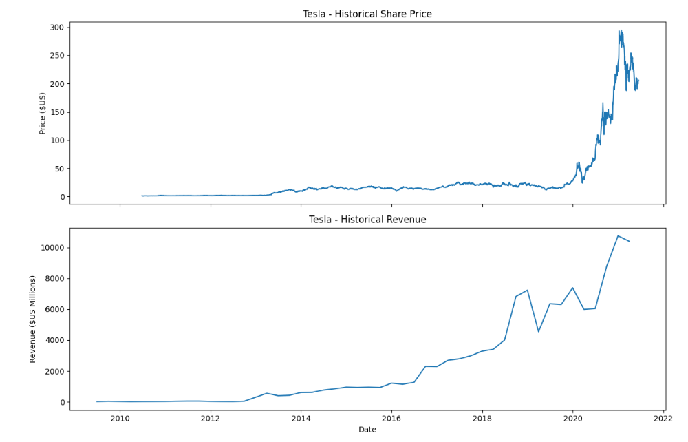

# tesla-gme-stock-analysis
## Tesla Stock & Revenue

Extracting stock data using APIs and web scraping, followed by data cleaning and visualization with Python.
# Stock Data Extraction & Visualization

This project demonstrates how to extract, clean, and visualize stock data using Python.

## What this project includes
- Extracting stock data using the yfinance API
- Web scraping revenue data using BeautifulSoup
- Data cleaning and preprocessing
- Visualizing stock price and revenue trends with Matplotlib

## Tools Used
- Python
- Pandas
- yfinance
- BeautifulSoup
- Matplotlib

## Key Insights
- Compared stock price trends with company revenue
- Identified growth patterns in Tesla and GameStop
- Visualized financial performance over time

## File
- `stock-data-extraction.ipynb` — main analysis notebook
